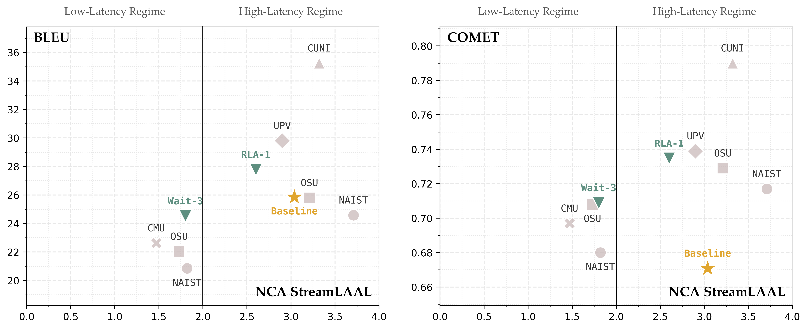

# Simultaneous Speech Translation: Latency–Quality Trade-offs

> Bachelor's Thesis — Exploring decoding policies and MBR-based strategies for streaming English→German speech translation.

This repository contains the full experimental pipeline for a Bachelor's thesis on **simultaneous speech-to-text translation (SimulST)**. The work investigates how different segmentation strategies, ASR emission policies, MT decoding policies, and Minimum Bayes Risk (MBR) re-ranking affect the trade-off between **translation latency** and **translation quality** in a cascade streaming system.

The system was also submitted to the **[IWSLT 2025](https://iwslt.org/)** shared task on simultaneous speech translation.

---

## Overview

The pipeline follows a **cascade architecture**: an ASR module transcribes incoming audio in a streaming fashion, and an MT module translates the incremental transcripts into the target language. At each step, policies decide whether to emit a new translation hypothesis or wait for more context.

**Languages:** English → German  
**Data:** ACL 2022 conference talks (dev/test splits)  
**Evaluation:** StreamLAAL, LongYAAL (latency) · BLEU, chrF++, COMET-XL (quality)

---

## Repository Structure

```
BThesis/
├── simulstream/          # Streaming translation framework (open-source library)
├── src/                  # Custom agents, policies, and system variants
│   ├── cascade/          # Original cascade baseline (Whisper + m2m100)
│   ├── cascade_2026/     # Enhanced cascade (Qwen3ASR + vLLM + MBR variants)
│   ├── fixed_segmenter/  # Fixed-chunk segmentation baseline
│   └── vad_segmenter/    # VAD-based segmentation baseline
├── data/                 # Dev and test sets (audio + references)
├── experiments/          # Configs, inference outputs, results, and visualizations
│   ├── baselines_trades/ # Baseline latency–quality sweeps
│   ├── iwslt_submission/ # IWSLT 2025 submission runs
│   ├── mbr_trades/       # MBR decoding experiments
│   └── policies_trades/  # ASR and MT policy comparison experiments
├── deps.txt              # Python package dependencies
└── .gitignore
```

See each subdirectory's `README.md` for detailed documentation.

---

## Installation

### Option A — conda (recommended)

```bash
conda env create -f environment.yml
conda activate bthesis
```

This installs Python 3.10, the `simulstream` library in editable mode, and all dependencies listed in `requirements.txt`.

### Option B — pip only

```bash
conda create -n bthesis python=3.10
conda activate bthesis

pip install -e simulstream/       # streaming framework (editable install)
pip install -r requirements.txt   # all remaining dependencies
```

### GPU note

`vllm` (used by the Cascade 2026 system) requires **CUDA ≥ 11.8** and sufficient GPU memory (≥ 16 GB recommended). Install PyTorch with the correct CUDA version first:

```bash
pip install torch --index-url https://download.pytorch.org/whl/cu121
```

See the [vLLM installation guide](https://docs.vllm.ai/en/latest/getting_started/installation.html) if you encounter issues.

### Key Dependencies

| Package | Purpose |
|---|---|
| `torch`, `transformers` | Core deep learning and model loading |
| `simulstream` | Streaming translation framework (local, editable) |
| `openai-whisper` | Whisper ASR (cascade baseline) |
| `qwen-asr` | Qwen3-ASR (cascade 2026 system) |
| `vllm` | High-throughput LLM inference for Qwen3 MT |
| `sacrebleu`, `fastchrf` | BLEU and chrF++ evaluation |
| `unbabel-comet` | COMET-XL / XCOMET-XL neural quality metric |
| `soundfile`, `pydub` | Audio I/O and format conversion |
| `pandas`, `matplotlib` | Results analysis and visualization |

All packages with their roles and version constraints are documented in [`requirements.txt`](requirements.txt).

---

## Quick Start

### Running a single inference

```bash
python -m simulstream.inference \
    --config experiments/baselines_trades/cascade/configs/cascade_step1.0_la1.yaml \
    --data-config data/dev/audio_definition.yaml \
    --output experiments/baselines_trades/cascade/inferences/my_run.jsonl
```

### Running the full baseline sweep (SLURM)

```bash
cd experiments/baselines_trades/cascade
sbatch inferences_cascade.sh   # runs all configs on GPU cluster
sbatch evaluations_cascade.sh  # evaluates all outputs
```

See [`experiments/README.md`](experiments/README.md) for the full workflow.

---

## Systems

Three baseline segmentation strategies are compared:

| System | Segmenter | ASR | MT |
|---|---|---|---|
| **Cascade** | Fixed-length (variable step) | Whisper small | m2m100\_418M |
| **Fixed** | Fixed-chunk | SeamlessM4T | SeamlessM4T |
| **VAD** | Voice Activity Detection | SeamlessM4T | SeamlessM4T |
| **Cascade 2026** | Fixed-length (variable seg) | Qwen3ASR | vLLM |

Advanced variants tested on top of Cascade 2026:

- **MBR decoding** — full, partial, and epsilon variants with XCOMET, chrF, and KIWI ranking
- **ASR policies** — Hold-N, Local Agreement, Tolerant Agreement
- **MT policies** — Wait-K, Hybrid Wait-K/TLA, Local Agreement, Tolerant Agreement

---

## Evaluation Metrics

| Metric | Type | Description |
|---|---|---|
| **StreamLAAL (NCA)** | Latency | Segment-level latency, no computational overhead |
| **StreamLAAL (CA)** | Latency | Computational-aware latency |
| **LongYAAL** | Latency | Word-level average lagging (OmniSTEval) |
| **BLEU** | Quality | n-gram precision (SacreBLEU) |
| **chrF++** | Quality | Character n-gram F-score with word order |
| **COMET-XL** | Quality | Neural reference-based quality (Unbabel XCOMET-XL) |

---

## Results Visualization

Open the analysis notebook:

```bash
jupyter notebook experiments/experiments_visuals.ipynb
```

It loads all CSV result files, produces latency–quality trade-off plots, and generates the figures used in the thesis.

---

## IWSLT 2025 Submission

The IWSLT 2025 submission runs are in [`experiments/iwslt_submission/`](experiments/iwslt_submission/). Three system variants were submitted: `baseline`, `low_latency`, and `high_latency`.



---

## Acknowledgements

This work builds on the [SimulStream](simulstream/) open-source streaming translation framework and uses evaluation tools from [OmniSTEval](https://github.com/hlt-mt/OmniSTEval), [SacreBLEU](https://github.com/mjpost/sacrebleu), and [Unbabel COMET](https://github.com/Unbabel/COMET).
